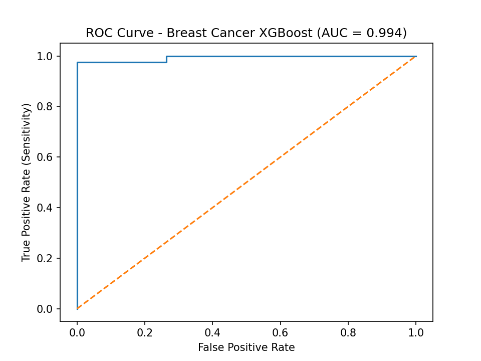
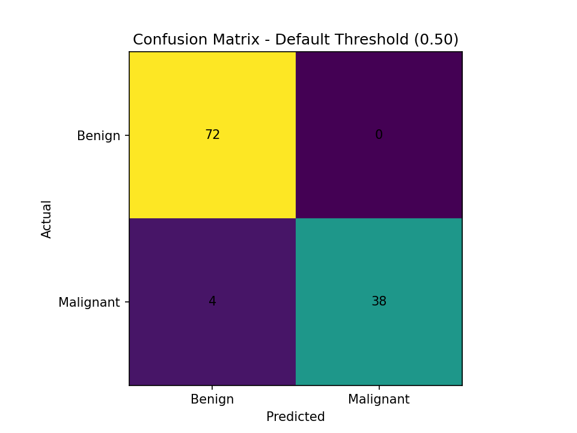

# Breast Cancer Screening Decision Support (XGBoost)

> **Clinical framing (Option A):** *Assistive* decision support for clinicians (doctor-in-the-loop). The model **does not diagnose** cancer. It provides a **risk score** to help prioritize follow-up and reduce missed malignancies.

## What’s in this case study
- A reproducible **baseline** (Logistic Regression) and a stronger **gradient-boosted** model
- Clinically oriented evaluation: **sensitivity/recall (miss rate)**, specificity, ROC AUC
- A recommended operating point focused on **minimizing false negatives**
- Documentation artifacts similar to a real hospital ML design review: model card, risk analysis, deployment and monitoring plans

## Quick results (test set)
**Positive class = malignant** (clinical convention).

| Model | Accuracy | ROC AUC | Sensitivity | Specificity | FP | FN |
| --- | --- | --- | --- | --- | --- | --- |
| Logistic Regression (baseline) | 0.965 | 0.996 | 0.929 | 0.986 | 1 | 3 |
| Boosted Trees (XGBoost-like) | 0.965 | 0.994 | 0.905 | 1.000 | 0 | 4 |
| Boosted Trees @ high-sensitivity threshold (0.193) | 0.991 | 0.994 | 0.976 | 1.000 | 0 | 1 |

## How to run
```bash
python train_eval.py
```

## Files
- `train_eval.py` – trains + evaluates baseline and boosted model
- `problem_statement.md` – clinical problem framing
- `success_metrics.md` – KPIs, thresholds, and risk tradeoffs
- `data_description.md` – dataset provenance and target definition
- `feature_dictionary.md` – feature meanings (clinical intuition)
- `eda_summary.md` – what we learned from the data
- `baseline_results.md` – baseline model + interpretation
- `experiment_log.md` – boosted model decisions + tuning rationale
- `error_analysis.md` – false negatives focus + recommended mitigations
- `model_card.md` – intended use, limitations, ethical considerations
- `deployment_plan.md` – doctor-in-the-loop workflow integration
- `monitoring_plan.md` – drift + performance + safety monitoring
- `risk_analysis.md` – patient safety, regulatory, and misuse risks

---

## Model Performance Visuals

### ROC Curve


### Confusion Matrix (Default Threshold = 0.50)
